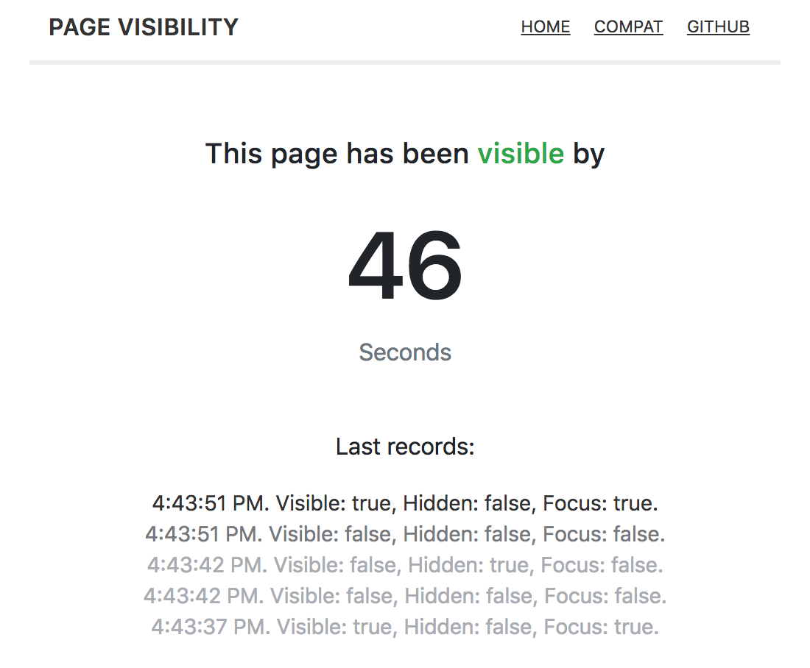

# React Page Visible




There are two common approaches to know if your page is currently visible by the user:
* [Focus event](https://developer.mozilla.org/en-US/docs/Web/Events/focus)
* [Page Visibility API](https://developer.mozilla.org/en-US/docs/Web/API/Page_Visibility_API)

None of the approaches does cover all user cases. For instance, switching to a different application, in desktop enviroment, does not trigger the Visibility API but the focus event. In a mobile device is the opposite. [See difference table](https://page-visibility.now.sh/compat)

This implementation, which is a React Component using render props, also introduces a new `visible` property which is aimed to cover both approaches and give a consistent behaviour across browsers and mobile devices.

[See demo](https://page-visibility.now.sh)

## Example
```js
import PageVisible from 'react-page-visible'

export default class App extends React.Component {
  render() {
    return (
      <PageVisible>
        {({ visible }) => (
          <h1>My page is {visible ? 'visible' : 'hidden'}</h1>
        )}
      </PageVisible>
    )
  }
}

```

## Development
This app is powered by [Next.js](https://nextjs.org).

Install dependencies
```
yarn
```

Start dev server:
```
yarn && yarn dev
```
